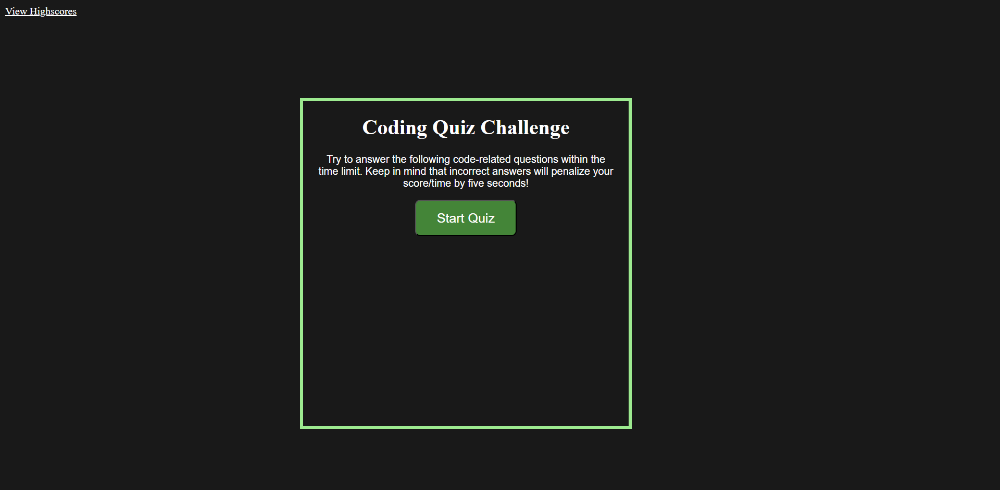

# Coding Quiz

## Project Description 

This project involved creating a timed coding quiz with multiple-choice questions. The application runs in the browser on a responsive site using HTML and CSS powered by Javascript code.

Below is a summary of the features that have been made to Javascript file.

# Usage

1. In order to run the application, click on the deployed application link.

2. Once you have been redirected to the web-page, user can click the "start quiz" button to begin the 5 question quiz which has a 60 second timer.

3. For any incorrectly answered questions 5 seconds is deducted from the timer. If the user does not complete the quiz in time, the quiz ends..

4. At the end of the quiz the user can record their score with their initials. This will save in the local storage and the user will be able to see any other scores within the local storage. There is an option to clear the scores too.

# Links
[Click here to access the deployed website.](https://fadumaabdi.github.io/codingQuiz/index.html)

[Click here to access the files on the github repository.](https://github.com/fadumaabdi/codingQuiz)

